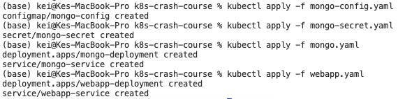
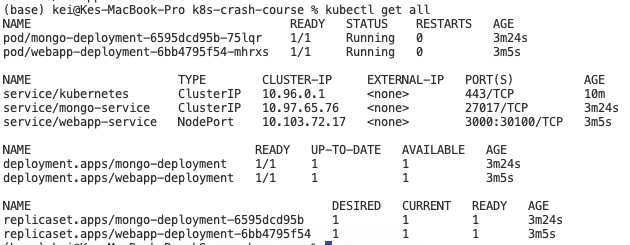
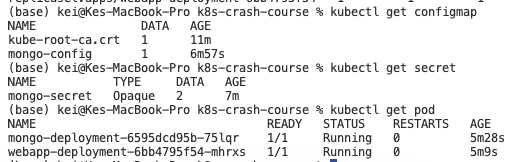
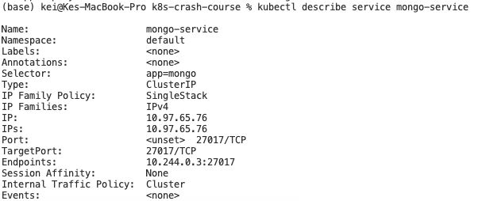
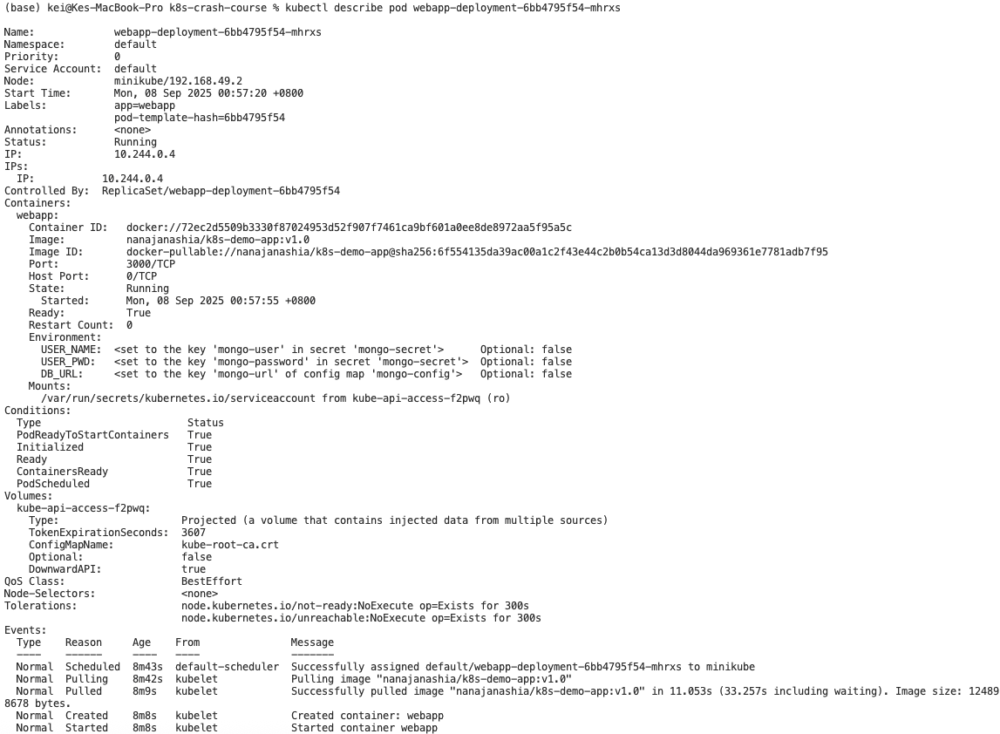
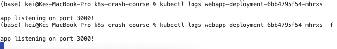
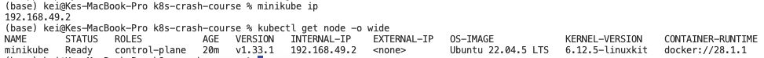

# [K8s Crash Course](https://www.youtube.com/watch?v=s_o8dwzRlu4&ab_channel=TechWorldwithNana)

## Setup 

Start Docker daemon
```bash
open -a Docker
```

Start minikube
```bash
minikube start
```

Check no components running
```bash
kubectl get pod
```

---
## Create components

Create external configurations
Config and secret must be created before Deployments 
```bash
kubectl apply -f mongo-config.yaml
kubectl apply -f mongo-secret.yaml
```

Create db
```bash
kubectl apply -f mongo.yaml
```

Create webapp service
```bash
kubectl apply -f webapp.yaml
```


---
## Interacting with the cluster

Get all components in the cluster
```bash
kubectl get all
```


```bash
kubectl get config map
kubectl get secret
kubectl get pod
kubectl get svc
```


#### kubectl help / describe

```bash
kubectl help
kubectl get --help
```

```bash
kubectl describe service mongo-service
```


```bash
kubectl describe pod webapp-deployment-6bb4795f54-mhrxs
```


#### kubectl logs
View logs in the pod

```bash
kubectl logs webapp-deployment-6bb4795f54-mhrxs
```


## Accessing the webapp from outside k8s

Get the minikube ip (192.168.49.2)
```bash
minikube ip
kubectl get node -o wide
```


```bash
open http://192.168.49.2:30100
```